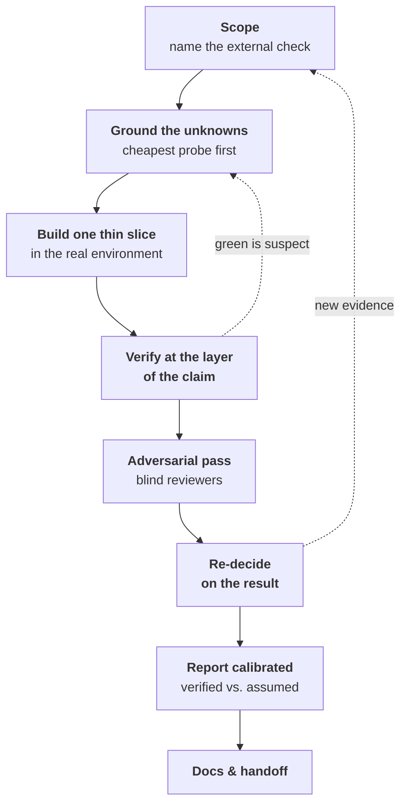

# fable-method

**A working discipline for Claude Code — where nothing is true until an independent check you did not author says so.**

[](./LICENSE)
[](./plugin.json)
[](https://docs.claude.com/en/docs/claude-code)
[](#self-contained-by-design)
[](#requirements)

`fable-method` is a self-contained Claude Code plugin for developers doing real engineering work with Claude. It installs a set of **gates** — checks the model runs at each step, wired to fire as reflexes — so it stops skipping the effortful ones under momentum: scope the work before building, ground assumptions before designing, get an independent adversary to attack the work before trusting it, check the actual claim (not just a green build that implies it) before declaring "done," and report what's verified apart from what's assumed.

Those reflexes are reverse-engineered from how Fable — Claude's `claude-fable-5` model — actually worked. ([Where it came from](#where-it-came-from).)

> **Session 10 in a project is sharper than session 1** — it learns and evolves, identifying what "correct" means and where the traps are.

---

## Contents

- [The problem](#the-problem)
- [What it installs](#what-it-installs)
- [Install](#install)
- [How do I know it's working?](#how-do-i-know-its-working)
- [The seven reflexes](#the-seven-reflexes)
- [The loop](#the-loop)
- [The runner skills](#the-runner-skills)
- [The self-building project memory](#the-self-building-project-memory--fableprojectmd)
- [The hooks](#the-hooks)
- [Where it came from](#where-it-came-from)
- [What it can and can't do](#what-it-can-and-cant-do)
- [Requirements](#requirements)
- [License](#license)

---

## The problem

A capable model rarely fails because it isn't smart enough. It fails because, under momentum, it skips the boring check:

- It **declares work done on its intention, not on evidence** — "this should work," then moves on.
- It **builds on a file, dataset, or API response it never actually opened.**
- It **rubber-stamps its own work** instead of getting an independent look.
- It **treats a green build as proof of the claim above it** — "it ran," "deploy healthy," "containers up" — none of which is "the output is correct."

Each of these is one skipped check. `fable-method` makes the check the path of least resistance instead of the thing you have to remember to do.

---

## What it installs

An **auto-triggering method skill**, **four runner skills**, and a **self-building per-project memory** (an overlay called `.fable/project.md`) — all on Claude Code's built-in tools only. The skill and runners keep the model honest in the moment; the [per-project memory](#the-self-building-project-memory--fableprojectmd) is what makes it **get sharper with use** — it learns how *your* project defines "done" and where its traps are.

The core principle: *the model's training memory, its prior rulings, a green build, and its own summaries are all **hypotheses**.* The method's whole job is to make the model **do the effortful check** — spawn an adversary, diff against an oracle (an independent source of the right answer), verify the actual claim — instead of skipping it under momentum.

<a name="self-contained-by-design"></a>
**Self-contained by design.** No runtime dependency on any other plugin or skill. When a runner needs backup — the adversarial review — it spawns plain **general-purpose subagents** with inline prompts; nothing else is required. Install it and it works. This mirrors how Fable itself worked: it embodied the discipline and dispatched its own adversaries rather than composing other people's tools.

---

## Install

This repo is its own Claude Code marketplace, so you install it straight from GitHub — no clone required:

```text
/plugin marketplace add debabsah/fable-method
/plugin install fable-method@fable-method
/reload-plugins
```

`/reload-plugins` picks up the skills and hooks in the current session — no restart needed. To remove it later, disable or uninstall it from the `/plugin` menu.

Prefer to manage it in config? In `~/.claude/settings.json` (user-wide) or a project's `.claude/settings.json` (per-repo):

```json
{
  "extraKnownMarketplaces": {
    "fable-method": { "source": { "source": "github", "repo": "debabsah/fable-method" } }
  },
  "enabledPlugins": { "fable-method@fable-method": true }
}
```

Once enabled, the method skill auto-triggers on task-shaped prompts; the runners and hooks are live immediately. Issues and contributions welcome at [github.com/debabsah/fable-method](https://github.com/debabsah/fable-method).

---

## How do I know it's working?

It's meant to be quiet — there's no banner. You'll see it on your next real task: the model pauses to **scope** the work and name what "correct" will be checked against; before it calls anything done it shows the **command it ran and the output**, not just "looks good"; when a claim is risky it **spawns blind reviewers** to attack the work; and in a new project it **offers to create `.fable/project.md`** and tells you when it adds to it. Those are the reflexes and runners described below.

---

## The seven reflexes

The method collapses into seven reflexes. Most named practices are one of these showing up in a different phase of work.

| # | Reflex | In practice |
|---|--------|-------------|
| **R1** | **Nothing is true until an independent check says so** | Name what "correct" is checked *against* before you build. Where the truth is hidden, build an **oracle** and diff over the whole population, not a sample. Verify at the layer of the *claim*, not the layer below it. Label numbers **PROVISIONAL** until proven. |
| **R2** | **Work the invariant, not the instance** | Fix the shared cause and `grep` every caller — patching only the site in front of you leaves the siblings broken. Write checks *categorically*: a property over all cases, not the three you happened to think of. |
| **R3** | **Externalize the adversary** | Don't rubber-stamp your own work. Spawn independent, blind reviewers and have them attack the *artifact*, not your claims about it. **Finding nothing wrong is a legitimate result.** When critique lands on your own work, fold it in and credit it. |
| **R4** | **Every decision is durable, revisable, and never silent** | Record each real decision with its rejected alternative and a revisit trigger. Version the plan with stamped changes. Put deferrals in explicit buckets — even record the *absence* of a decision. |
| **R5** | **The report is part of the work** | Lead with the answer, then a ledger that keeps *"verified by running X"* structurally apart from *"assuming Y, couldn't check."* Cite specifics: paths, counts, `file:line`, before→after deltas. Never soften a real problem — including your own. |
| **R6** | **The human owns authority; you own labor** | Interview one decomposed question at a time, each with a recommendation and its rejected cost. Gate the irreversible and the genuinely ambiguous. Once the human rules, it's binding — don't relitigate. |
| **R7** | **Match effort to reversibility; reproduce reality** | Spend where reversal is expensive; defer the cheap-to-change with a written trigger. Prove one **thin end-to-end slice** before scaling. Iterate in a faithful copy of the real environment. Every incident mints a runnable rule. |

---

## The loop

On any non-trivial task, the reflexes run as a cycle — not a waterfall. Later steps feed back into the earlier ones as evidence arrives.



---

## The runner skills

Each effortful step has a runner. They auto-trigger, or you can invoke one by name.

| Situation | Runner | What it does |
|-----------|--------|--------------|
| Starting, or the scope is fuzzy | **`fable-scope`** | Define "done" as a named external check; split *known (evidence)* from *assumed (inference)*; name the 1–3 load-bearing unknowns and the cheapest probe to retire each. |
| Before you trust an answer, design, or plan | **`fable-review`** | Spawn N blind, independent adversaries in parallel — one lens each — then dedup, verify every finding against the source, and triage fix-now / defer / accept. |
| Before you claim done, fixed, or passing | **`fable-verify`** | The evidence-before-claims gate: identify the command that would *prove* the claim → run it fresh → read the whole output → verify at the layer of the claim → *then* claim it. |
| Shipping or handing off | **`fable-ship`** | A calibrated done-claim (answer-first, verified-vs-assumed), docs-as-done so a stranger could redo it, and compaction of the project overlay. |

---

## The self-building project memory — `.fable/project.md`

*This is the part that gets better the more you use it.*

The method skill is **general** — the same reflexes for every project. But real rigor is **project-specific**: what "correct" actually means *here*, where the truth lives, the local conventions, and the traps that already bit you once. So the plugin ships general and lets **each workspace grow its own `.fable/project.md`** — a small, git-ignored file that is the method's **memory for that one project**, and gets sharper every session you work in it.

The reflexes keep the model honest in the moment. The overlay is where that honesty turns into **accumulated, project-specific expertise**.

**What it holds** (thin, and only what's confirmed):

- **The acceptance oracle** — the single highest-value fact: how "correct" is *checked* here. This is what R1 and `fable-verify` diff against.
- **Pointers to the canonical docs** — where truth lives (`CLAUDE.md`, runbooks). It *points*, never copies, so nothing goes stale.
- **Conventions & guardrails** — the project-specific method notes.
- **A running Gotchas log** — every trap you hit and diagnosed, as `trap → cause → rule`, so the model never steps on the same landmine twice.

**How the pieces work together:**

- **It bootstraps itself.** The first time you do real work in a project, the skill *offers* to create it — scanning `CLAUDE.md` / `README` / stack signals and asking only the gaps (starting with *"what's the acceptance oracle here?"*). You don't hand-author it.
- **It's always in the room, for near-free.** A `SessionStart` hook surfaces its one-line pointer as ambient context every session; the full file is read only when the method triggers (*tiered loading* — no cost while idle).
- **`fable-scope` reads it first**, so new work is scoped on top of what's already known — it won't re-derive settled facts or re-step on a logged trap.
- **It writes itself as you learn.** When the model *confirms* a durable fact — the oracle, a convention, or (especially) a gotcha — it appends it and **announces the change** ("added X to `.fable/project.md`"). Confirmed-only; it doesn't hoard guesses.
- **`fable-ship` compacts it** — dedup, retire the stale, promote the recurring — so it stays a tight page instead of sprawling.

A trimmed overlay reads like this:

```markdown
<!-- pointer: acme-api — oracle: contract tests in tests/contract/ must pass. Canonical: CLAUDE.md. Full: .fable/project.md -->

## Acceptance oracle(s)
- "Correct" = `make contract-test` green across ALL endpoints (not a sampled subset).

## Gotchas (log every trap)
- migrations pass locally, fail in CI → CI seeds a fresh DB, local reuses one
  → always test against a fresh DB (`make db-reset` first).
```

**Why it lives in the workspace, git-ignored:**

- **No fingerprint in your repo.** It's git-ignored by default, so it stays out of your commits — no AI-method artifact in a production codebase, and no per-project fork of the plugin.
- **It rides the project, not the machine.** Per-project by construction; no cross-machine sync to manage.
- **Update-safe.** Updating this plugin never touches your overlays.

See [`skills/fable-method/references/project-template.md`](skills/fable-method/references/project-template.md) for the full shape.

---

## The hooks

Two small, optional hooks:

- **`SessionStart`** — surfaces the current project's overlay pointer as ambient context (silent if there's no overlay).
- **`PreToolUse`** — an advisory nudge toward opening a pull request when a command looks like a direct push to `main`. It only advises and never blocks; real enforcement should come from branch protection.

---

## Where it came from

"Fable" is Claude's **`claude-fable-5`** model. This method wasn't invented from first principles — it was **reverse-engineered from watching Fable actually work**.

The source was **dozens of long-horizon sessions of Fable doing real, end-to-end development work** — genuine build-from-scratch engineering across every phase, from first scoping through shipping and handoff, in sessions sustained long enough to run past 58,000 turns. That corpus was dissected by **~18 independent, blind, read-only reviewers across 12 analytical lenses**, under a strict evidence protocol (cite everything; separate *observed* from *inferred*; no confabulation):

| # | Lens | Focus |
|---|------|-------|
| 01 | Scoping & framing | "done" = a named external check; known vs. assumed; reframing the ask |
| 02 | Evidence & grounding | cheapest-probe-first; read the source of truth; build the verification oracle |
| 03 | Adversarial self-critique | spawn blind reviewers; audit by invariant; downgrade your own verdicts |
| 04 | Uncertainty & decisions | provisional vs. proven; drive the disagreement to zero |
| 05 | Verification & validation | verify at the layer of the claim; categorical tests over the whole population |
| 06 | Debugging & incidents | root cause = *the escape*; `grep` every caller; incident → runnable rule |
| 07 | Planning & sequencing | versioned plans; deferral buckets; readiness-based sequencing |
| 08 | Guardrails & safety | PR-flow; reversibility; permission gates |
| 09 | Reporting & communication | answer-first; verified-vs-assumed; never soften a real problem |
| 10 | Human-in-the-loop | one-question-at-a-time interviews; manual gates for the irreversible |
| 11 | Documentation & handoff | docs-as-done; operator runbooks; cold-start layering |
| 12 | Tool use & environment | CI-parity execution; grep-by-invariant; the delegation policy |

The seven reflexes and the loop above are the distilled output of that study.

---

## What it can and can't do

**This plugin will not give you Fable's raw intelligence or judgment.** That does not transfer, and no skill can fake it. What it installs is Fable's **gates** — the checks it ran at each step of real development, now firing as reflexes. The intelligence stays yours to supply; the gates catch the large class of *momentum* mistakes: unverified "done," building on unopened files, self-rubber-stamping, symptom-not-root-cause fixes, uncalibrated claims. **Well-practiced gates catch a lot in real work, even without the horsepower.**

---

## Requirements

- **Claude Code** with plugin support.
- **A capable model.** Target: **Opus 4.8**. The design assumption is deliberate — a strong model doesn't need *forcing* (a rigid harness); it needs the reflexes *installed* and the effortful moves made *cheap to invoke*.

---

## License

MIT © `debabsah`. See [LICENSE](./LICENSE).
