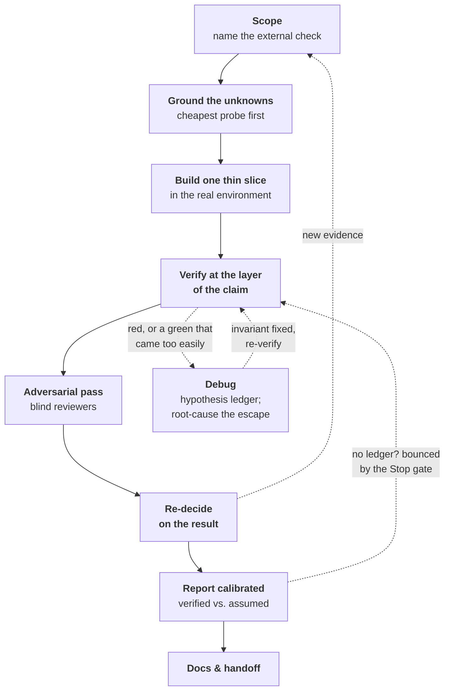

# fable-method

**A working discipline for Claude Code — where nothing is true until an independent check you did not author says so.**

[](./LICENSE)
[](./.claude-plugin/plugin.json)
[](https://docs.claude.com/en/docs/claude-code)
[](#self-contained-by-design)
[](#requirements)

`fable-method` is a self-contained Claude Code plugin for developers doing real engineering work with Claude. It installs a set of **gates** — checks the model runs at each step — so it stops skipping the effortful ones under momentum: scope the work before building, ground assumptions before designing, get an independent adversary to attack the work before trusting it, check the actual claim (not just a green build that implies it) before declaring "done," diagnose by designed experiment — not patch-and-pray — when something breaks, and report what's verified apart from what's assumed.

The claim moment gets a **deterministic backstop**: a Stop hook bounces completion claims that arrive without their ledger, so "done" arrives as `Verified: <what> — ran <command> -> saw <result>`, or an honest `Assumed:`/`PROVISIONAL`. You act on the report by reading one short list — what it says it couldn't check — instead of re-deriving the work.

Those reflexes are reverse-engineered from how Fable — Claude's `claude-fable-5` model — actually worked. ([Where it came from](#where-it-came-from).)

> **Session 10 in a project is sharper than session 1** — it learns and evolves, identifying what "correct" means and where the traps are.

---

## Contents

- [The problem](#the-problem)
- [What it installs](#what-it-installs)
- [Install](#install)
- [How do I know it's working?](#how-do-i-know-its-working)
- [The seven reflexes](#the-seven-reflexes)
- [The loop](#the-loop)
- [The ledger](#the-ledger--one-shape-for-every-claim)
- [The code stance](#the-code-stance--calibrated-code)
- [The plan shape](#the-plan-shape)
- [The runner skills](#the-runner-skills)
- [The self-building project memory](#the-self-building-project-memory--fableprojectmd)
- [The hooks](#the-hooks)
- [Where it came from](#where-it-came-from)
- [What it can and can't do](#what-it-can-and-cant-do)
- [Getting the best results](#getting-the-best-results)
- [Requirements](#requirements)
- [License](#license)

---

## The problem

A capable model rarely fails because it isn't smart enough. It fails because, under momentum, it skips the boring check:

- It **declares work done on its intention, not on evidence** — "this should work," then moves on.
- It **builds on a file, dataset, or API response it never actually opened.**
- It **rubber-stamps its own work** instead of getting an independent look.
- It **treats a green build as proof of the claim above it** — "it ran," "deploy healthy," "containers up" — none of which is "the output is correct."
- It **debugs by mutation** — patch, rerun, hope — and calls the third attempt at the same fix progress.
- It **forgets in-flight work between sessions** — decisions get re-litigated, half-done tasks restart from zero.

Each of these is one skipped check or one lost record. `fable-method` makes the check the path of least resistance instead of the thing you have to remember to do.

---

## What it installs

An **auto-triggering method skill**, **five runner skills**, **two deterministic hooks** (project memory and in-flight tasks in at SessionStart; the calibration gate out at Stop), and a **self-building per-project memory** (an overlay called `.fable/project.md`, with `.fable/tasks/` beside it for work that spans sessions) — all on Claude Code's built-in tools only. The skill and runners keep the model honest in the moment; the [per-project memory](#the-self-building-project-memory--fableprojectmd) is what makes it **get sharper with use** — it learns how *your* project defines "done" and where its traps are.

The core principle: *the model's training memory, its prior rulings, a green build, and its own summaries are all **hypotheses**.* The method's whole job is to make the model **do the effortful check** — spawn an adversary, diff against an oracle (an independent source of the right answer), verify the actual claim — instead of skipping it under momentum.

<a name="self-contained-by-design"></a>
**Self-contained by design.** No runtime dependency on any other plugin or skill. When a runner needs backup — the adversarial review — it spawns plain **general-purpose subagents** with inline prompts; nothing else is required. Install it and it works. This mirrors how Fable itself worked: it embodied the discipline and dispatched its own adversaries rather than composing other people's tools.

---

## Install

This repo is its own Claude Code marketplace, so you install it straight from GitHub — no clone required:

```text
/plugin marketplace add debabsah/fable-method
/plugin install fable-method@fable-method
/reload-plugins
```

`/reload-plugins` picks up the skills and hooks in the current session — no restart needed. To remove it later, disable or uninstall it from the `/plugin` menu.

Prefer to manage it in config? In `~/.claude/settings.json` (user-wide) or a project's `.claude/settings.json` (per-repo):

```json
{
  "extraKnownMarketplaces": {
    "fable-method": { "source": { "source": "github", "repo": "debabsah/fable-method" } }
  },
  "enabledPlugins": { "fable-method@fable-method": true }
}
```

Once enabled, the method skill auto-triggers on task-shaped prompts; the runners and hooks are live immediately. Issues and contributions welcome at [github.com/debabsah/fable-method](https://github.com/debabsah/fable-method).

---

## How do I know it's working?

It's meant to be quiet — there's no banner. You'll see it on your next real task: the model pauses to **scope** the work and name what "correct" will be checked against; before it calls anything done it shows the **command it ran and the output**, not just "looks good"; when a claim is risky it **spawns blind reviewers** to attack the work; when a fix doesn't hold it runs a **hypothesis ledger** — predicted-outcome probes, cheapest first — instead of a third patch; and in a new project it **offers to create `.fable/project.md`** and tells you when it adds to it.

One part you can watch directly: when a turn that edited files tries to end on a bare "done, tests passing," the **calibration gate bounces it** until the claim carries its ledger. Each live bounce is logged to `.fable/gate-log`, and `bash hooks/test-gate.sh` runs the gate's self-checks. Those are the reflexes, runners, and hooks described below.

---

## The seven reflexes

The method collapses into seven reflexes. Most named practices are one of these showing up in a different phase of work.

| # | Reflex | In practice |
|---|--------|-------------|
| **R1** | **Nothing is true until an independent check says so** | Name what "correct" is checked *against* before you build. Where the truth is hidden, build an **oracle** and diff over the whole population, not a sample. Verify at the layer of the *claim*, not the layer below it. Label numbers **PROVISIONAL** until proven. |
| **R2** | **Work the invariant, not the instance** | Fix the shared cause and `grep` every caller — patching only the site in front of you leaves the siblings broken. Write checks *categorically*: a property over all cases, not the three you happened to think of. |
| **R3** | **Externalize the adversary** | Don't rubber-stamp your own work. Spawn independent, blind reviewers and have them attack the *artifact*, not your claims about it. **Finding nothing wrong is a legitimate result.** When critique lands on your own work, fold it in and credit it. |
| **R4** | **Every decision is durable, revisable, and never silent** | Record each real decision with its rejected alternative and a revisit trigger. Version the plan with stamped changes. Put deferrals in explicit buckets — even record the *absence* of a decision. |
| **R5** | **The report is part of the work** | Lead with the answer, then a ledger that keeps *"verified by running X"* structurally apart from *"assuming Y, couldn't check."* Cite specifics: paths, counts, `file:line`, before→after deltas. Never soften a real problem — including your own. |
| **R6** | **The human owns authority; you own labor** | Interview one decomposed question at a time, each with a recommendation and its rejected cost. Gate the irreversible and the genuinely ambiguous. Once the human rules, it's binding — don't relitigate. |
| **R7** | **Match effort to reversibility; reproduce reality** | Spend where reversal is expensive; defer the cheap-to-change with a written trigger. Prove one **thin end-to-end slice** before scaling. Iterate in a faithful copy of the real environment. Every incident mints a runnable rule. |

---

## The loop

On any non-trivial task, the reflexes run as a cycle — not a waterfall. Later steps feed back into the earlier ones as evidence arrives.



Work that spans sessions checkpoints the loop: `.fable/tasks/<slug>.md` records each decision at *Re-decide* and is retired at *Docs & handoff*, so the next session resumes mid-loop instead of restarting from zero.

---

## The ledger — one shape for every claim

The method's visible surface: every completion claim carries the same three tokens, so you read one shape — this week and next year.

```text
Verified: <claim> — ran <command/observation> -> saw <result>
Assumed: <what it couldn't check> — why — how you can check it
PROVISIONAL: <number/result not yet safe to quote>
```

The Stop hook greps for exactly these tokens: a done-claim with none of them gets bounced back once, to attach its evidence or downgrade itself. The gate enforces the format of honesty; the skills carry the substance. And a report from any agent — including subagents the model spawned — counts as a claim, not evidence, until it's checked against the source (the **provenance rule**).

---

## The code stance — calibrated code

The reflexes calibrate claims; the stance calibrates the code itself, against the most universal bad habit in software — graceful degradation that hides breakage. No silent failure paths: a fallback announces itself or doesn't exist. Fail-open vs fail-closed is chosen by blast radius, and a comment names the choice. Code leaves evidence — scripts print what they did, with numbers. Loud at trust boundaries, assertive inside. Comments state constraints, not narration. And house style always beats the stance: it fills silence in a codebase, never fights a convention.

It composes with minimalism modes like ponytail — they govern how much code exists; this governs how it fails and what evidence it leaves. Full text: [`skills/fable-method/references/code-stance.md`](skills/fable-method/references/code-stance.md).

---

## The plan shape

Scoping names the check; the plan shape governs everything between there and done. **Resolution decays with distance** — the next step or two are concrete (commands, files, expected output), and everything past the next verification point stays a coarse bucket until the frontier reaches it. **Every step ends at a checkpoint, not an activity** ("after this, `X` prints `Y`" — never "implement Z"), so execution moves from verified state to verified state. **Steps are sequenced by information, not deliverable order**, retiring load-bearing unknowns first. **The plan is a versioned hypothesis, not a contract** — when evidence contradicts it, re-planning is the success path, recorded in the task file. Re-plans redraw the route, never the **anchors**: the acceptance oracle, the scope fence, and explicit human rulings stay fixed, and moving one is an escalation to the human, not a revision. And **decomposition follows the risk tier, not a template**: a reversible tweak needs a next-action line, not a phase document.

That last rule is the deliberate contrast with plan-doc-then-execute pipelines: rails help a model that lacks the judgment; on a strong one, uniform upfront detail anchors execution against evidence. `fable-method` keeps the artifacts — the written plan, per-step checks, decision records — and skips the uniform ceremony.

---

## The runner skills

Each effortful step has a runner. They auto-trigger, or you can invoke one by name.

| Situation | Runner | What it does |
|-----------|--------|--------------|
| Starting, or the scope is fuzzy | **`fable-scope`** | Define "done" as a named external check; split *known (evidence)* from *assumed (inference)*; name the 1–3 load-bearing unknowns and the cheapest probe to retire each. |
| Something's wrong — a bug, an unexplained error, a fix that didn't hold | **`fable-debug`** | Reproduce first; state the contradiction; run a hypothesis ledger of predicted-outcome probes, cheapest first; fix the invariant, verify red→green on the exact reproduction, then root-cause *the escape* and mint the rule that would have caught it. |
| Before you trust an answer, design, or plan | **`fable-review`** | Spawn N blind, independent adversaries in parallel — one lens each — then dedup, verify every finding against the source, and triage fix-now / defer / accept. |
| Before you claim done, fixed, or passing | **`fable-verify`** | The evidence-before-claims gate: identify the command that would *prove* the claim → run it fresh → read the whole output → verify at the layer of the claim → *then* claim it. |
| Shipping or handing off | **`fable-ship`** | A calibrated done-claim (answer-first, verified-vs-assumed), docs-as-done so a stranger could redo it, and compaction of the project overlay. |

---

## The self-building project memory — `.fable/project.md`

*This is the part that gets better the more you use it.*

The method skill is **general** — the same reflexes for every project. But real rigor is **project-specific**: what "correct" actually means *here*, where the truth lives, the local conventions, and the traps that already bit you once. So the plugin ships general and lets **each workspace grow its own `.fable/project.md`** — a small, git-ignored file that is the method's **memory for that one project**, and gets sharper every session you work in it.

The reflexes keep the model honest in the moment. The overlay is where that honesty turns into **accumulated, project-specific expertise**.

**What it holds** (thin, and only what's confirmed):

- **The acceptance-oracle table** — the single highest-value fact: how "correct" is *checked* here, one row per claim type, with the command *and what pass literally prints* (exit 0 with `3 skipped` is not the pass you meant). This is what R1 and `fable-verify` diff against.
- **Pointers to the canonical docs** — where truth lives (`CLAUDE.md`, runbooks). It *points*, never copies, so nothing goes stale.
- **Conventions & guardrails** — the project-specific method notes.
- **A running Gotchas log** — every trap you hit and diagnosed, as `trap → cause → rule`, so the model never steps on the same landmine twice.

**How the pieces work together:**

- **It bootstraps itself.** The first time you do real work in a project, the skill *offers* to create it — scanning `CLAUDE.md` / `README` / stack signals and asking only the gaps (starting with *"what's the acceptance oracle here?"*). You don't hand-author it.
- **It's always in the room, for near-free.** A `SessionStart` hook surfaces its one-line pointer as ambient context every session; the full file is read only when the method triggers (*tiered loading* — no cost while idle).
- **`fable-scope` reads it first**, so new work is scoped on top of what's already known — it won't re-derive settled facts or re-step on a logged trap.
- **It writes itself as you learn.** When the model *confirms* a durable fact — the oracle, a convention, or (especially) a gotcha — it appends it and **announces the change** ("added X to `.fable/project.md`"). Confirmed-only; it doesn't hoard guesses.
- **`fable-ship` compacts it** — dedup, retire the stale, promote the recurring — so it stays a tight page instead of sprawling.
- **It expires toward doubt.** Entries carry a last-confirmed date; stale ones demote to *working assumptions* until re-checked — the memory can be wrong only briefly, never confidently.
- **In-flight work rides beside it.** Each multi-session task keeps a `.fable/tasks/<slug>.md` — its scope, anchors, decision log (`chose X over Y because Z; revisit if W`), deferrals, and a `next:` pointer the `SessionStart` hook surfaces (with a mechanical staleness stamp once it sits untouched) — opened by `fable-scope`, retired by `fable-ship`. The overlay remembers the *project*; task files remember the *work in flight*, so session 10 resumes instead of re-deriving.
- **It keeps the score.** Beside the overlay live `.fable/claims-log` — every shipped `Verified:`, which `fable-debug` marks FALSIFIED when a vouched-for behavior later breaks — and `.fable/residuals.md`, the undischarged `Assumed:`/`PROVISIONAL` lines, surfaced at SessionStart until discharged. Over weeks, that record answers the question the ledger alone can't: whether the `Verified:` token deserves your trust.

A trimmed overlay reads like this:

```markdown
<!-- pointer: acme-api — oracle: contract tests in tests/contract/ must pass. Canonical: CLAUDE.md. Full: .fable/project.md -->

## Acceptance oracle(s)
- "Correct" = `make contract-test` green across ALL endpoints (not a sampled subset) — pass prints `24/24 contracts OK`.

## Gotchas (log every trap)
- migrations pass locally, fail in CI → CI seeds a fresh DB, local reuses one
  → always test against a fresh DB (`make db-reset` first).
```

**Why it lives in the workspace, git-ignored:**

- **No fingerprint in your repo.** It's git-ignored by default, so it stays out of your commits — no AI-method artifact in a production codebase, and no per-project fork of the plugin.
- **It rides the project, not the machine.** Per-project by construction; no cross-machine sync to manage.
- **Update-safe.** Updating this plugin never touches your overlays.

See [`skills/fable-method/references/project-template.md`](skills/fable-method/references/project-template.md) for the full shape.

---

## The hooks

Two hooks — memory in, calibration out:

- **`SessionStart`** — surfaces the current project's overlay pointer and one line per in-flight task file (`.fable/tasks/*.md`, each with its `next:` action) as ambient context; silent when there's neither.
- **`Stop` — the calibration gate.** When the **current turn** edited files (built-in or MCP editing tools) and ends on a completion claim with no `Verified:`/`Assumed:`/`PROVISIONAL` marker, the gate blocks the stop once and sends the model back to run the proving command now — or downgrade the claim. Loop-safe, fail-open on any parsing doubt. In projects with an overlay it logs every bounce *and* every armed pass to `.fable/gate-log`, with the matched phrase — so both failure directions, over-firing and under-firing, are tunable from data rather than guesswork. Known dark paths (mutations made via shell commands, novel completion phrasings) are documented in the script and tuned from that log. Self-checks: `bash hooks/test-gate.sh`.

Keeping `main` safe from direct pushes belongs to branch protection on your forge, which covers every client — so this plugin leaves it there (v0.1's advisory push hook was removed after real-payload testing showed it unreliable in both directions).

---

## Where it came from

"Fable" is Claude's **`claude-fable-5`** model. This method wasn't invented from first principles — it was **reverse-engineered from watching Fable actually work**.

The source was **dozens of long-horizon sessions of Fable doing real, end-to-end development work** — genuine build-from-scratch engineering across every phase, from first scoping through shipping and handoff, in sessions sustained long enough to run past 58,000 turns. That corpus was dissected by **~18 independent, blind, read-only reviewers across 12 analytical lenses**, under a strict evidence protocol (cite everything; separate *observed* from *inferred*; no confabulation):

| # | Lens | Focus |
|---|------|-------|
| 01 | Scoping & framing | "done" = a named external check; known vs. assumed; reframing the ask |
| 02 | Evidence & grounding | cheapest-probe-first; read the source of truth; build the verification oracle |
| 03 | Adversarial self-critique | spawn blind reviewers; audit by invariant; downgrade your own verdicts |
| 04 | Uncertainty & decisions | provisional vs. proven; drive the disagreement to zero |
| 05 | Verification & validation | verify at the layer of the claim; categorical tests over the whole population |
| 06 | Debugging & incidents | root cause = *the escape*; `grep` every caller; incident → runnable rule |
| 07 | Planning & sequencing | versioned plans; deferral buckets; readiness-based sequencing |
| 08 | Guardrails & safety | PR-flow; reversibility; permission gates |
| 09 | Reporting & communication | answer-first; verified-vs-assumed; never soften a real problem |
| 10 | Human-in-the-loop | one-question-at-a-time interviews; manual gates for the irreversible |
| 11 | Documentation & handoff | docs-as-done; operator runbooks; cold-start layering |
| 12 | Tool use & environment | CI-parity execution; grep-by-invariant; the delegation policy |

The seven reflexes and the loop above are the distilled output of that study.

The study artifacts aren't bundled in this repo — read this section as provenance, not proof. The parts you can verify yourself are the gates: `bash hooks/test-gate.sh`.

---

## What it can and can't do

**This plugin will not give you Fable's raw intelligence or judgment.** That does not transfer, and no skill can fake it. And it cannot make any single claim *true* — no text check can. What it enforces is **calibration**: claims arrive labeled with their evidence (`Verified:`) or their doubt (`Assumed:`/`PROVISIONAL`), the stopping moment is gated deterministically, and your project's own definition of "correct" rides along in the overlay. The gates catch the large class of *momentum* mistakes: unverified "done," building on unopened files, self-rubber-stamping, symptom-not-root-cause fixes, uncalibrated claims.

Your job, even when everything works: read the short `Assumed:` list, and rule on the outward or production actions it gates to you. **Worry-less means that residual list is short and honest — not that it is empty.**

---

## Getting the best results

**Pair it with an economy mode — they own different axes.** `fable-method` never tells the model how *much* code to write; it governs whether you can trust what comes back (the gates, the ledger, the memory) and how the code fails (the stance). A minimalism mode like [ponytail](https://github.com/DietrichGebert/ponytail) owns the other axis: does this need to exist, reuse before writing, shortest working diff. Run both and each does its own job — the economy mode decides how much code exists; `fable-method` decides whether the claims about it hold. The one seam between them — announcements and asserts make code slightly longer than pure minimalism would write — has a documented tie-breaker in [`code-stance.md`](skills/fable-method/references/code-stance.md): safety is never traded for brevity, and ponytail's own carve-outs say the same from its side.

- **Answer the oracle question.** When the method offers to create `.fable/project.md`, the minute you spend naming the real acceptance oracle is the highest-leverage minute in this plugin — every scope, verify, and gate decision compounds on it.
- **Say a runner's name when the stakes are real.** The runners auto-trigger, but "run fable-review on this plan" or "fable-verify that" fires the gate deterministically instead of hopefully — worth doing before anything hard to reverse.
- **Don't fight a gate bounce.** A bounce isn't an error; it's a claim being recalibrated to its evidence. If bounces recur, read `.fable/gate-log` — a repeating pattern there is a working-habits gotcha, and `fable-ship` folds it into the overlay.
- **Keep pure code diffs with your dedicated review tooling** if your environment ships some; the fable runners cover everything else — plans, analyses, schemas, configs, prose — and work with nothing else installed.
- **Let the environment enforce what it can.** Branch protection, permission gates, and secrets belong to your forge and harness ([what transfers, and what can't](skills/fable-method/references/transfer-tiers.md)); the method self-enforces only where the environment has no reach.

---

## Requirements

- **Claude Code** with plugin support.
- **A capable model.** Built and tuned for **Opus 4.8 at medium–xhigh effort**. The design assumption is deliberate: a strong model already knows these moves; what it still lacks is exactly what's installed here — deterministic firing at the claim moment (reflexes drift under momentum and at lower effort), your project's definition of "correct," and one uniform trust format.

---

## License

MIT © `debabsah`. See [LICENSE](./LICENSE).
